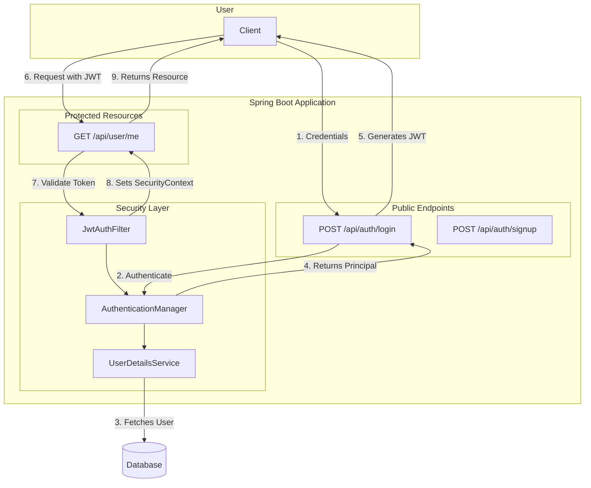
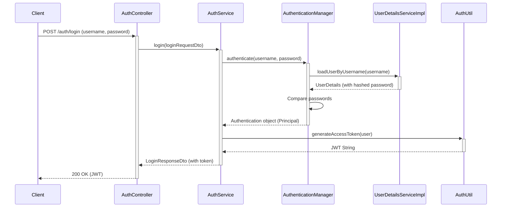
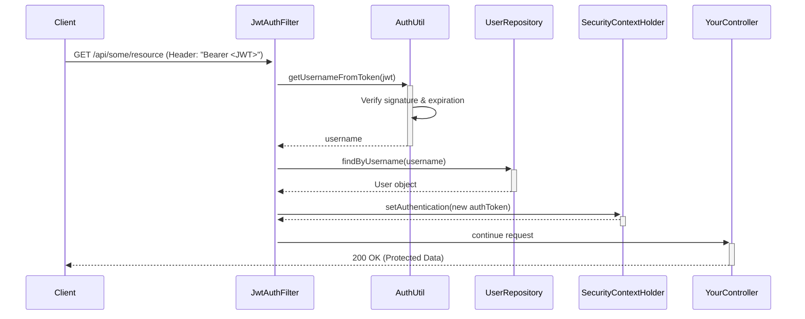

# System Patterns: JWT Authentication Architecture

This document outlines the design patterns and architectural components of the JWT-based authentication system in this Spring Boot application.

## 1. High-Level Architecture

The authentication system follows a token-based, stateless pattern. The key components and their interactions are as follows:

## 2. Key Architectural Patterns

- **Filter Chain:** Spring Security uses a chain of filters to process incoming HTTP requests. Our custom `JwtAuthFilter` is inserted into this chain to inspect for a JWT in the `Authorization` header.
- **Service-Oriented Design:**
    - `UserDetailsService`: A core Spring Security interface that acts as a bridge to the application's user store (e.g., a database). It's responsible for fetching user details by username.
    - **Authentication Service:** A dedicated service (`AuthService`) often encapsulates the logic for user registration and login, separating concerns from the controllers.
- **Dependency Injection:** Spring's DI framework is used to wire all components together (e.g., injecting `UserDetailsService` and `JwtUtil` into the security configuration and filters).
- **Stateless Authentication:** The server does not maintain session state. The JWT contains all the necessary information to identify the user, making each request self-contained.
## 3. Detailed Sequence Diagram

This diagram shows the detailed step-by-step flow for both authentication (login) and authorization (accessing a protected resource).

### Login Flow

### Protected Resource Access Flow

### API Contract
For a detailed overview of all API endpoints, refer to the [API Contract](api-contract.md).